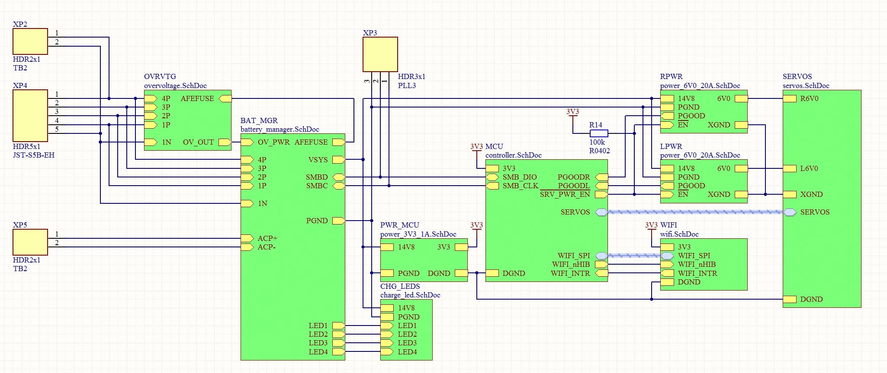

# Модуль управления шестиногим шагающим роботом

Пока добавил сюда только кодик. Как сдам диплом, нормально оформлю ридми и залью сюда всю доку и рпз

Реальное управление в hxaServer. raspberry pi через wifi связана с платой. Основное веселье в **hxaServer.py** ...

Стм - это чисто контроллер серв, он получал периоды шима и их тупа отрабатывает на сервах. Подбробнее можно почитать [здесь](http://easyelectronics.ru/upravlenie-mnozhestvom-servomashinok.html)

Ниже можно посмотреть НЕ ГОСТ варианты доки

